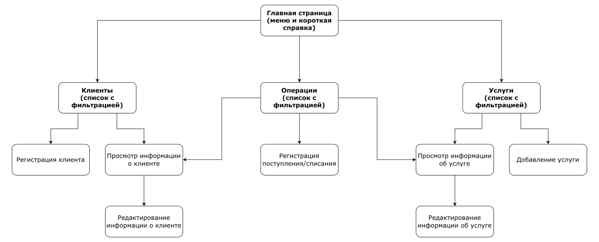
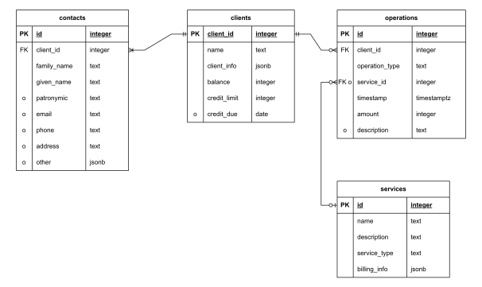

:::: {align="center"}

План проекта "Биллинговая база оператора связи"

::::

# Описание страниц

{width="100%"}

На каждой странице есть меню сбоку, с ссылками на выделенные жирным
страницы.

-   Главная страница

    -   Короткая информация об интерфейсе

-   Клиенты

    -   Список со следующими полями:

        -   численный id клиента

        -   название/имя клиента

        -   тип клиента

        -   текущий баланс

        -   текущий кредитный лимит и срок погашения (если есть)

    -   Фильтры:

        -   по id

        -   по балансу --- min/max значения

        -   текстовый поиск --- название/ФИО контактных лиц/контактная
            информация содержат строку

        -   по услугам --- вводится интервал времени, за который
            оказывались какие-то услуги, а также фильтры по этим услугам
            (те же, что в таблице услуг, см. ниже)

    -   Запись в списке ведёт на страницу клиента

    -   Кнопка для регистрации нового клиента (ведёт на страницу
        регистрации клиента, можно ввести все поля, что показываются на
        странице клиента, кроме id и баланса, см. ниже)

-   Просмотр информации о клиенте

    -   вышеперечисленная информация из таблицы

    -   "идентифицирующие данные" --- в виде пар ключ/значение, свои для
        каждого типа клиента (см. про это ниже в описании БД)

    -   список контактных лиц --- ФИО, контактная информация
        (телефон/email/адрес --- какая есть, а также при желании
        дополнительно пары ключ/значение с доп. контактами)

    -   Кнопка для редактирования (ведёт на страницу редактирования
        клиента, редактировать можно все поля, кроме id и баланса)

-   Услуги

    -   Список со следующими полями:

        -   id услуги

        -   название

        -   описание (в таблице возможно урезано, полностью показано на
            странице услуги)

        -   тип услуги

    -   Фильтры:

        -   по id

        -   текстовый поиск по названию/описанию

        -   по типу услуги

        -   по параметрам биллинга (поиск по строковым значениям,
            min/max по числовым)

    -   Записи ведут на страницы услуг (на которых помимо
        вышеперечисленных полей ещё информация о биллинге в виде пар
        ключ/значение) -\> оттуда ссылка на страницу редактирования
        (редактировать можно все поля, кроме id)

    -   Кнопка добавления услуги (заполнять можно все поля, кроме id)

-   Операции

    -   Операцией является как пополнение счёта, так и списание с него

    -   Список с полями:

        -   id операции

        -   id клиента, к которому относится операция

        -   тип операции

        -   услуга (если есть)

        -   описание (если есть)

        -   время

        -   дельта баланса

    -   Фильтры по всем полям

    -   Из записи можно перейти на страницы соответствующего клиента и
        услуги (если операция связана с какой-то услугой, обычно
        списание)

    -   Операции иммутабельны --- один большой лог событий.
        Предполагается, что, например, для отката списания нужно просто
        зарегистрировать новое пополнение

    -   Кнопка добавления операции (можно заполнить всё, кроме id и
        времени)

# Сценарии использования

### Получение списка клиентов, в т.ч. по оказываемым услугам в заданном интервале времени, по характеристикам их счетов

Главная страница $\rightarrow$ Клиенты $\rightarrow$ применение нужных
фильтров заполнением полей/выборов опций $\rightarrow$ получение
результата запроса в виде списка, возможно с пагинацией/динамической
подгрузкой, если слишком много записей

### Получение росписи операций по счету клиента за заданный интервал времени

Главная страница $\rightarrow$ Операции $\rightarrow$ применение нужных
фильтров заполнением полей/выборов опций (в данном случае --- ввести id
нужного клиента и границы интервала времени) $\rightarrow$ получение
результата запроса в виде списка, возможно с пагинацией/динамической
подгрузкой, если слишком много записей

### Регистрация договора об оказании услуги

Главная страница $\rightarrow$ Клиенты $\rightarrow$ кнопка добавления
нового клиента $\rightarrow$ заполнение полей в соответствии с
заключённым договором об оказании услуг связи

### Регистрация поступлений на счет и списаний

Главная страница $\rightarrow$ Операции $\rightarrow$ кнопка добавления
новой операции $\rightarrow$ заполнение нужных полей

### Добавление и удаление данных о клиенте, чтение и редактирование данных о нем

Главная страница $\rightarrow$ Клиенты $\rightarrow$ поиск нужного
клиента в списке с помощью фильтров $\rightarrow$ переход по ссылке на
страницу клиента $\rightarrow$ кнопка для редактирования информации или
кнопка удаления клиента соответственно

### Добавление и удаление услуги, чтение и редактирование данных о ней

Главная страница $\rightarrow$ Услуги $\rightarrow$ поиск нужной услуги
в списке с помощью фильтров $\rightarrow$ переход по ссылке на страницу
услуги $\rightarrow$ кнопка для редактирования информации или кнопка
удаления услуги соответственно

# Схема базы данных

Основные таблицы --- для клиентов (`clients`), услуг (`services`) и
операций (`operations` --- самая большая таблица с логом событий по всем
счетам). В отдельной таблице (`contacts`) хранятся контактные лица, т.к.
их может быть несколько у одного клиента.

Клиентом может быть как физическое лицо, так и юридическое, а может быть
и ИП, и ещё что-нибудь. У разных типов клиентов могут быть разные
"идентифицирующие данные" --- у физлиц это, например, паспортные данные,
у юрлиц это какие-нибудь данные из государственного реестра. По этой
причине в `client_info` таблицы `clients` хранится jsonb с
соответствующими данными. У клиента есть баланс (он должен быть равен
сумме всех изменений баланса во всех операциях, относящихся к счёту).
Баланс может уходить в минус не более, чем на `credit_limit`, у кредита
может быть срок погашения.

Пример данных клиентов: в таблице `clients`, к примеру, для записи с
типом `INDIVIDUAL` будет `client_info` вида
`{"passport_number": "4700123456", "passport_issue_date": "2025-02-26"}`.

Считается, что контактные лица относятся к конкретному клиенту, т.е. как
сущности в БД они не могут принадлежать сразу нескольким клиентам (для
моделирования такой ситуации будет несколько записей в этой таблице на
одно и то же контактное лицо, при этом контактная информация может быть
заполнена в разной мере). В таблице контактных лиц есть также jsonb-поле
`other`, в котором хранятся кастомные поля, дополнительно добавленные
пользователем (например, это может быть какой-нибудь дополнительный
номер телефона или хэндл в мессенджере). Схема поля `other` ---
json-объект со строковыми ключами и строковыми значениями.

Услуги содержат название, описание, тип услуги (например
звонки/интернет/смс), а также тип биллинга и информация о нём (например
это может быть различная частота списания, отдельные цены на подключение
и продление услуги и т.д.) --- для этого используется поле
`billing_info` --- json-объект.

Операции относятся к какому-то клиенты и имеют временную метку. Операции
могут быть разных видов (пополнение, подключение услуги, списание
регулярной платы за услугу и т.д.). Операция обычно изменяет баланс, в
таком случае у неё есть `amount` --- изменение баланса (положительное
или отрицательное). Также она может относиться к какой-то услуге (обычно
это касается списаний).
